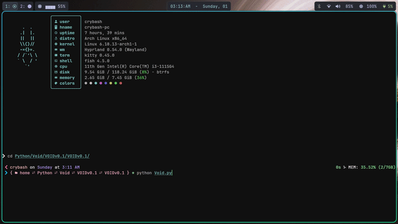
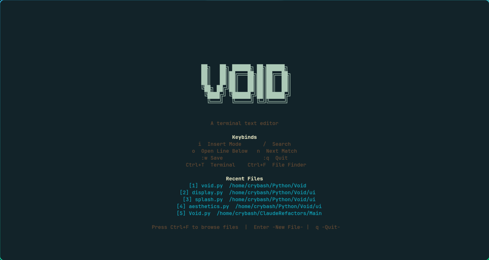
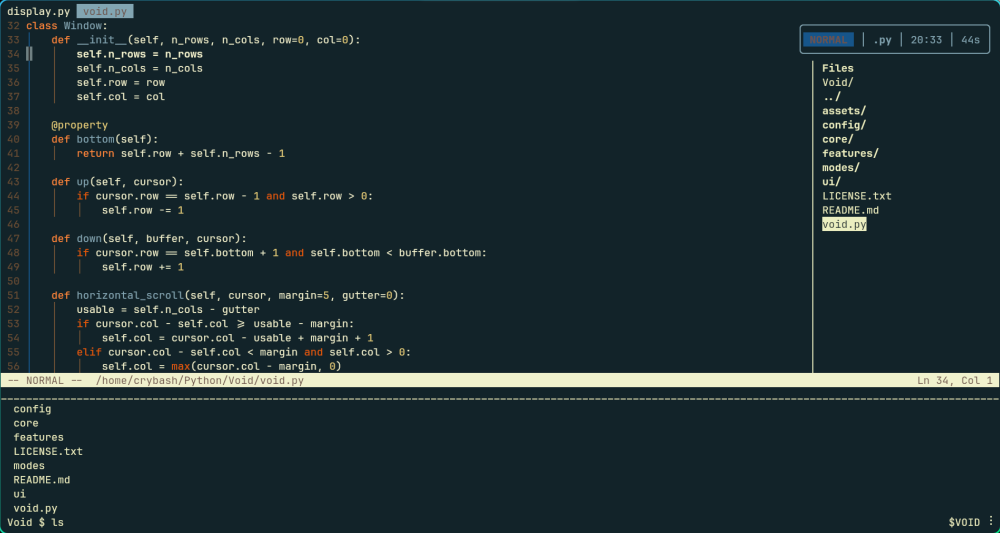

<p align="center">
  <pre align="center">
██╗   ██╗ ██████╗ ██╗██████╗ 
██║   ██║██╔═══██╗██║██╔══██╗
██║   ██║██║   ██║██║██║  ██║
╚██╗ ██╔╝██║   ██║██║██║  ██║
 ╚████╔╝ ╚██████╔╝██║██████╔╝
  ╚═══╝   ╚═════╝ ╚═╝╚═════╝ 
  </pre>
  <em>A terminal text editor that refuses to pick a side.</em>
</p>

---


## What is Void?

Void is a terminal-native text editor built from scratch in Python with the curses library. Although inspired by Vim/Neovim, it does not aim to clone them. I am a pretty new Dev and have so much to learn and this project in no way is already finalized on its long term progress. It shares a baseline with other terminal editors, that I believe is necessary for rich user experiences. After that baseline and standard of doing things I think I can create something that is its own thing, with features of both IDEs and terminal editors while also incorporating unique features that would really give this tool its own identity.




I believe there is a niche space that could be filled in the world of editors and Dev environments, On one end, you have Vim and Neovim — fast, endlessly configurable, but quite minimal by design. On the other, you have full blown IDEs/Dev environments that are rich with features, visually intuitive, but with heavy and inefficient mouse-driven workflows, I want Void to live in the space between. I want to try and see how far you can really go with something like this, nothing is set in stone and ideas can change and boundaries of a space like this can most certainly be pushed in my opinion.

I have Vim motions as the current foundation of movement because I believe that language of movement is simply the fastest way to navigate and manipulate text. There are many standards/features in both IDEs and terminal editors I plan to inherit because some things shouldn't change, but I truly want to push boundaries that we didn't even know could exist in the editor space.

Tabbed editing. An embedded terminal. A file finder panel. Visual selection. Syntax highlighting. Find and replace with confirmation workflows. Auto-pairing. Auto-indentation. Undo history. A floating HUD. All of it running inside your terminal, all of it driven by the keyboard, and all of it just the beginning.

## Current State

**Void is a work in progress.** It has rough edges, I am VERY new to shipping any type of software let alone a tool of this scope. There are still plenty of missing features and things will or may break and my ideas aren't all concrete, but that is a good thing in my opinion, I have already gotten tons of useful feedback from the community and I want this to be something that more than just me finds enjoyable and/or useful. This is an actively evolving project, not a polished release BY ANY MEANS. So much stuff is subject to change, improvement and outright being thrown out.

That said — it works. You can open files, edit them, save them, search through them, select and manipulate text visually, manage tabs, run shell commands, and navigate your filesystem without ever leaving the terminal or reaching for a mouse.

## Features

- **Vim motions** — `h` `j` `k` `l`, `w` `b`, `gg` `G`, `d` + motion, `yy`, `p`, and more
- **Modal editing** — Normal, Insert, Visual, and Command modes
- **Visual mode** — Character (`v`), Line (`V`), and Block (`Ctrl+V`) selection with delete, yank, change, and indent operations
- **Tabbed buffers** — Open multiple files, switch between them with `gt`/`gT` or `:tabn`/`:tabp`
- **Integrated terminal** — Toggle an inline shell panel with `Ctrl+T`, run commands without leaving the editor
- **File finder** — Browse and open files from a side panel with `Ctrl+F`
- **Search and replace** — `/query` to search, `/find/replace/g` for bulk replace, `/find/replace/gc` for confirmation-based replace
- **Syntax highlighting** — Token-based highlighting for Python, C++, C, Rust and JavaScript (more languages to come)
- **Auto-indentation** — Smart indent that respects Python block structures
- **Auto-pairing** — Brackets, braces, parentheses, and quotes auto-close in Insert mode
- **Undo/Redo** — Full undo history with `u` and `Ctrl+R`
- **Bracket matching** — Highlights the matching bracket or quote under the cursor
- **Indent guides** — Vertical guides drawn through indentation levels, with active block highlighting
- **Cursor line highlighting** — Visual emphasis on the current line
- **Floating HUD** — Mode indicator, filetype, clock, and session timer in a top-right overlay
- **Horizontal scrolling** — Smooth margin-based scrolling for long lines
- **Splash screen** — Animated matrix rain startup with recent file access and keybind hints
- **Recent files** — Tracks and surfaces your recently opened files on launch





## Getting Started

### Requirements

- Python 3.x
- A terminal emulator with color support

### Usage

```bash
# Open Void with the splash screen
python void.py

# Open a specific file
python void.py myfile.py
```

## Keybinds

A full keybind reference is available in [`keybinds.md`](keybinds.md).

**Quick overview:**

```
NORMAL                          INSERT
h j k l .... move cursor        Esc ........ back to Normal
w b ........ word jump          Enter ...... new line (auto-indent)
0 $ ^ ...... line start/end     Backspace .. delete behind
gg / G ..... file top/bottom    ([{"' ...... auto-pair
Ctrl+D/U ... half-page scroll

i .......... enter Insert       VISUAL (v / V / Ctrl+V)
o / O ...... open line below/   h j k l .... extend selection
             above              d / x ...... delete selection
dd ......... delete line        y .......... yank selection
dw d$ d0 ... delete motion      c .......... change selection
yy ......... yank line          > / < ...... indent / dedent
p / P ...... paste after/before
u .......... undo               TERMINAL (Ctrl+T)
Ctrl+R ..... redo               Esc ........ back to editor
v .......... visual (char)      Enter ...... run command
V .......... visual (line)      Up/Down .... command history
Ctrl+V ..... visual (block)
/ .......... search             FILE FINDER (Ctrl+F)
n / N ...... next/prev match    j/k ........ navigate
gt / gT .... next/prev tab      Enter ...... open / navigate
                                h .......... go back a directory
                                r .......... refresh file finder
                               `.` ........ show hidden files (dots)
COMMAND MODE (:)
:w  :q  :wq  :q!  :e <file>  :tabnew <file>  :saveas <file>
```

## Project Structure

```
Void/
├── void.py              Entry point, main loop, screen drawing, event dispatch
├── config/
│   └── keys.py          Named constants (keycodes, defaults, config values)
├── core/
│   ├── buffer.py        Text buffer (line storage, insert, delete)
│   ├── editing.py       Undo/redo system, auto-indent and snapshot management
│   └── tab.py           Tab + TabManager (per-tab buffer/cursor/undo)
├── modes/
│   ├── keybinds.py      Key dispatch, EditorState, command mode, tab/file helpers
│   ├── vim_motions.py   Normal mode vim motions (hjkl, w, b, d, y, etc.)
│   ├── visual.py        Visual mode state + operations (delete, yank, change, indent)
│   └── search.py        Search/Replace state + prompt
├── ui/
│   ├── display.py       Syntax highlighting, tokenizer, line drawing, safe_addstr
│   ├── splash.py        Animated splash screen and recent file tracking
│   └── aesthetics.py    Floating HUD widget (mode label, clock, time-elapsed and filetype)
├── features/
│   ├── terminal.py      Inline terminal panel (subprocess, history, draw)
│   └── file_finder.py   File browser panel
└── assets/
    └── ...              Logo images and demo GIF
```

## The Road Ahead

Void is being built with love and excitement for a tool that could go so many directions, I have big plans for it, but these early development stages are about finding out what plans are viable, useful and actually make sense. The current Python/curses implementation is the proving ground — a place to explore my ideas, the communities ideas and eventually settling in to something sustainable and long term!

A few long term goals include rewriting performance critical parts in a systems language as the project grows. It will have broader language support, plugin architecture, and features that have traditionally been reserved for heavyweight editors, but also features you would not expect in a terminal based tool. The most important thing about this whole project is that I never stop learning, never stop improving and heeding the advice of much more experienced developers than myself.

This is just the beginning of a project I am already deeply fond of :p 

VOID.v0.1 

---

<p align="center">
  <sub>Built from scratch. No dependencies. No compromises. Just the terminal.</sub>
</p>

## License

Void is licensed under the [Apache License v2.0](LICENSE).
